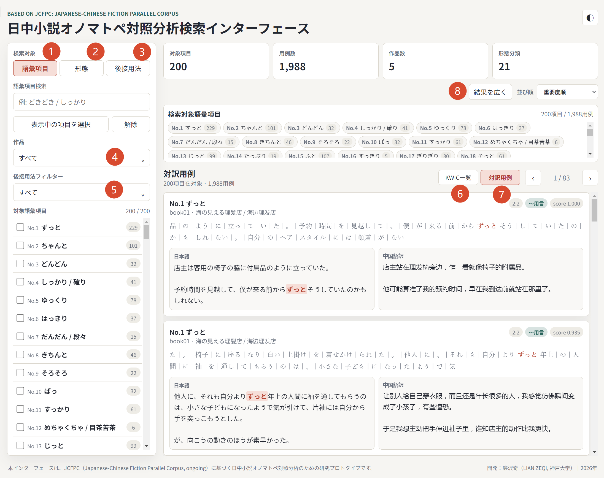

# 日中小説オノマトペ対照分析検索インターフェース

**▶ デモページ：https://lzq628.github.io/jcfpc-onomatopoeia-interface/**（スマートフォン対応）

JCFPC（Japanese-Chinese Fiction Parallel Corpus, ongoing）に基づく、日中小説オノマトペ対照分析のための研究プロトタイプです。

約200語の日本語オノマトペを対象に、日中対訳例を検索・閲覧できます。語彙項目、形態、後接用法から用例を絞り込み、KWIC表示と対訳表示を切り替えて確認できます。

## 画面と主な機能

| No.  | 機能               | 説明                                                         |
| :--: | :----------------- | :----------------------------------------------------------- |
|  1   | 語彙項目検索       | 約200語のオノマトペから対象語を指定して検索                  |
|  2   | 形態別検索         | 21の形態分類（ABAB・AっBりなど）から検索。形態ごとの翻訳傾向を確認できる |
|  3   | 後接用法別検索     | 「〜と用言」「〜する」などの後接用法から検索。用法ごとの翻訳傾向を確認できる |
|  4   | 作品別フィルター   | 特定の作品に絞って用例を表示                                 |
|  5   | 後接用法フィルター | 指定した語 × 指定した用法の組み合わせで用例を絞り込み        |
|  6   | KWIC一覧表示       | 検索語を中心に前後の文脈を揃えて一覧表示（コーパス研究で標準的な表示形式） |
|  7   | 対訳用例表示       | 日本語原文と中国語訳を用例単位で対照表示                     |
|  8   | 表示幅の切り替え   | 結果表示の幅を切り替え、画面サイズに合わせて閲覧しやすく表示 |

## データ作成パイプライン

本インターフェースの背後にあるデータは、以下の工程で開発者が構築したものです（コーパス構築パイプライン自体は本リポジトリには含まれません）。

1. 現代日本小説5作品とその中国語訳5冊を底本として選定
2. 書籍のOCR、外字処理、テキストクリーニング
3. MeCabによる形態素解析（日本語側 約60万形態素）
4. embeddingモデルを用いた文単位の日中アラインメント
   （複数モデルによる交差検証を設計し、人手修正を全体の約2％まで低減）
5. SQLiteによるデータ管理と、検索用データへの変換

## JCFPCについて

JCFPC（Japanese-Chinese Fiction Parallel Corpus）は、日中小説対訳研究のために構築中のパラレルコーパスです。本インターフェースは、そのうち日本語オノマトペの分析に関わる範囲を対象としています。JCFPC本体は現在も構築・整備中です。

## 技術構成

- 静的サイト（HTML／CSS／JavaScript）。検索対象データはJS形式で同梱
- GitHub Pagesで公開。静的ホスティングにそのまま配置可能

## 公開範囲と著作権

本公開版は、研究発表用の限定的なインターフェースです。原作品の著作権に配慮し、以下の方針をとっています。

- 用例は検索結果として表示される短い文単位の抜粋に限定
- 原文・訳文の全文閲覧機能、および一括ダウンロード機能は提供しない
- 対象語彙はオノマトペ研究に必要な範囲に固定

## 引用

本インターフェースまたはJCFPCに言及される場合は、以下をご参照ください。

> Lian, Zeqi (2026). Embedding-Assisted Construction of a Japanese-Chinese Parallel Corpus of Contemporary Novels. The 6th Asia Pacific Corpus Linguistics Conference (APCLC2026).

## 開発者

廉 沢奇（LIAN Zeqi）
神戸大学大学院 国際文化学研究科
2026年

本ページは研究用プロトタイプであり、神戸大学の公式サービスではありません。

## English

This is a research prototype for Japanese–Chinese onomatopoeia contrastive analysis, based on JCFPC (Japanese-Chinese Fiction Parallel Corpus, ongoing).

**Demo: https://lzq628.github.io/jcfpc-onomatopoeia-interface/**

See the annotated screenshot above for the main features.

The interface provides curated access to approximately 200 Japanese onomatopoeic items and their Japanese–Chinese parallel examples, with filtering by lexical item, morphological pattern, and following usage class, in both KWIC and parallel-example views. The underlying data were built by the author through a pipeline of OCR, text cleaning, morphological analysis (MeCab), and embedding-assisted sentence alignment (manual correction reduced to approx. 2%), managed in SQLite.

Developed by LIAN Zeqi, Graduate School of Intercultural Studies, Kobe University, 2026.